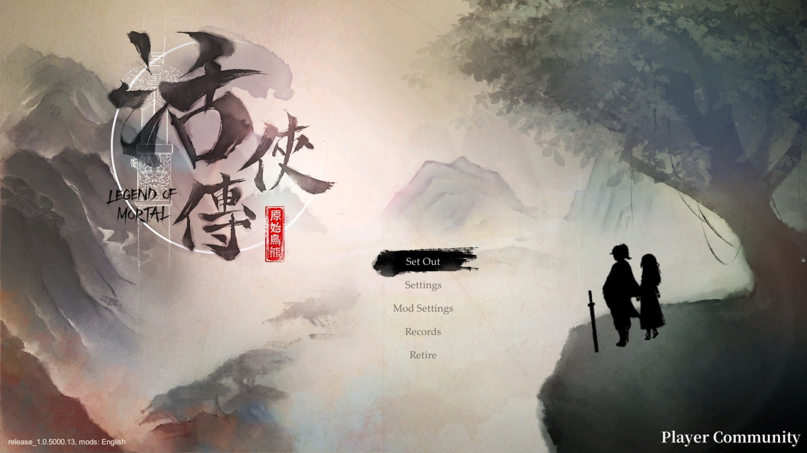
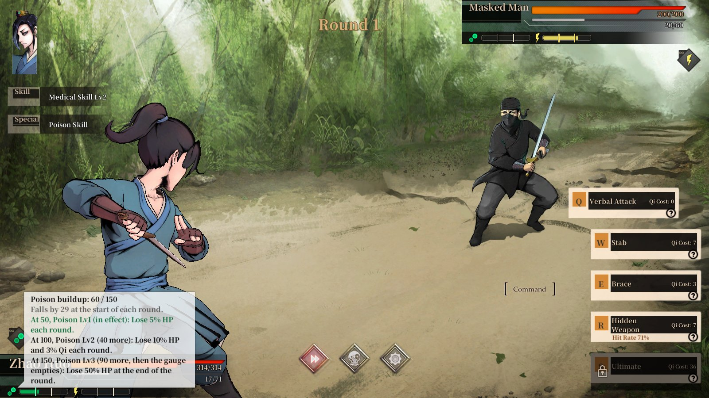

# LOM English Localization + QoL

A complete, reviewed English translation of **Legend of Mortal** (活俠傳, Obb Studio) with layout fixes for English and a
handful of quality-of-life features: quick save, character and faction tooltips, clearer duel gauges and an in-game
settings window.

**[Download the latest release](https://github.com/DataRogue/LOM-English-Localization-QoL/releases/latest)** ·
[Install](#install) · [Features](#features) · [Troubleshooting](#troubleshooting) ·
[Report a problem](https://github.com/DataRogue/LOM-English-Localization-QoL/issues)

## Highlights

- **The whole game in English, reviewed line by line.** All 72,524 game-data entries and 52,714 scene lines were reviewed
  in their scene for accuracy and for the wuxia voice of the original. About 39,000 of them were rewritten, under one
  glossary with fixed names, titles and martial-arts terms. Choice lines were checked against the story scripts they lead
  to.
- **Screens that fit English.** Layout fixes for the status, martial arts, shop, library, battle and army battle screens,
  translated title and menu images, horizontal layouts where vertical Chinese text was stacked, English numerals, and
  dialogue spacing and reveal speed tuned for text that runs about twice as long as the Chinese.
- **Quality of life.**
  - Quick save (F5) and quick load (F9).
  - Tooltips on character names in dialogue (portrait, title, your affinity) and on faction names (a short, spoiler-free
    description).
  - The exact affinity value in Status > Social.
  - Poison and paralysis tier marks on the duel gauges, with exact values.
- **Survives game updates.** Each feature checks the game at startup and turns itself off cleanly if an update breaks it,
  while the rest keeps working. If you also have the OverLlm patch installed, its lines fill in where an update changed
  the text.
- **Standalone.** Everything it needs is in the download. It also works alongside the
  [OverLlm English patch](https://github.com/joshfreitas1984/LegendOfMortalOverLlm) it grew from, and never changes that
  patch's files.

## Install

You need Legend of Mortal on Steam for Windows, with the game language on **Traditional Chinese** (the default); the mod
shows that language in English. It is tested with game version `release_1.0.5000.13` (Steam build 20337760).

1. Download `LOM-English-Localization-QoL-<version>-full.zip` from
   [Releases](https://github.com/DataRogue/LOM-English-Localization-QoL/releases/latest).
2. In Steam, right-click Legend of Mortal > **Manage** > **Browse local files**. This opens the folder that holds
   `Mortal.exe`.
3. Extract the zip into that folder, so that `winhttp.dll` and the `BepInEx` folder sit next to `Mortal.exe`.
4. Start the game. The title screen now has a **Mod Settings** button; F8 opens the same window anywhere.

The full package includes [BepInEx](https://github.com/BepInEx/BepInEx) 6.0.0-be.692, the mod loader. If you already
have it, for example because the OverLlm English patch is installed, use the smaller `-mod-only.zip` instead.

**Updating:** delete the folder `BepInEx/plugins/LOM_UI_EN`, then extract the new `-mod-only.zip` into the game folder.
Your settings are kept in `BepInEx/config`.

**Uninstalling:** delete `BepInEx/plugins/LOM_UI_EN`. If no other mod uses BepInEx, also delete the `BepInEx` folder,
`winhttp.dll`, `doorstop_config.ini`, `.doorstop_version` and `changelog.txt`. Steam's "Verify integrity of game files"
does not remove mods.

**Steam Deck and Linux (Proton):** not tested. BepInEx under Proton usually needs the launch option
`WINEDLLOVERRIDES="winhttp=n,b" %command%`.

## Features

### Translation

- The complete text, carried by the mod itself. The OverLlm patch is optional.
- One glossary for names, sects, titles, ranks and martial arts: 唐門 is always the Tang Clan and 內力 always Internal
  Force, and the Little Junior Sister stays the Little Junior Sister.
- Names restored where the machine translation turned them into words (a given name rendered as "Mermaid Bell" is
  a person again).
- Choice lines checked against the story branch each one leads to, so the option you pick says what happens.
- With the OverLlm patch installed, Mod Settings > Translation can switch to its text, or fall back to its line
  wherever one of this mod's no longer fits the game after an update.

### Localization fixes

- Layout rules for the screens where English would overflow, overlap or be cut off.
- Translated images for the title, menus and other baked-in Chinese art.
- Horizontal layouts, English numerals, and dialogue line spacing tuned for English.
- Faster text reveal and a guard for long dialogue logs, because English runs about twice the length of the Chinese
  and would otherwise crawl or blank the backlog.

### Extras (all optional, in Mod Settings > Extras)

- **Quick save and quick load** (F5 / F9) to the slot the game's own Save button uses, wherever the game allows saving.
- **Character tooltips.** Names of characters with portrait art are coloured in dialogue and choice menus. Point at one
  for their portrait, title and your affinity with them. A character only gets a tooltip once the story has introduced
  them, so the tooltips never spoil a reveal.
- **Faction tooltips.** Sect, clan and gang names get a short, spoiler-free description, so you know which is which.
- **Exact affinity.** Hovering a level in Status > Social shows the value out of 100.
- **Duel gauges.** The poison and paralysis gauges get a mark at every tier (50, 100, 150). Pointing at a gauge shows
  the exact build-up, what each tier does, how far off it is, and how much the build-up falls each round.

### Mod Settings

F8, or the button on the title screen and in the pause menus. The pages are:
- Translation, Localization and Extras, ordered from closest to the original game to furthest from it.
- Compatibility, for the state after a game update.
- Advanced, for everything technical.
- About.

Settings take effect at once, except one font setting on Advanced, which needs a restart.

## Troubleshooting

- **Nothing changed, and there is no Mod Settings button.** The files are probably one folder too deep. `winhttp.dll`
  must be next to `Mortal.exe`, not inside a `LOM-English-Localization-QoL...` folder. After a start, `BepInEx/LogOutput.log`
  should exist.
- **Some text is still in Chinese.** Check that the game language is Traditional Chinese. After a game update, new or
  changed text stays Chinese until the mod is updated; Mod Settings > Compatibility says what changed.
- **My antivirus flags `winhttp.dll`.** It is BepInEx's loader, Unity Doorstop, and is unmodified from the official
  BepInEx release. Loaders like it are a common false positive.
- **After a game update, a feature is marked as not working.** It switched itself off to keep the game working. The rest
  of the mod is fine. Please report it, attaching the report described below.

## Reporting a problem

Open an [issue](https://github.com/DataRogue/LOM-English-Localization-QoL/issues) and attach:
- `compat_report.txt`, from Mod Settings > Compatibility > **Write a report** (it is written to
  `BepInEx/plugins/LOM_UI_EN`);
- `BepInEx/LogOutput.log`;
- a screenshot, for anything about text or layout.

For a translation error, the Chinese line and where it appears help most.

## How the translation was made

This mod started from the OverLlm English patch, a machine translation of the whole game, and went through a series
of passes:
- a terminology glossary built from the game data, with 23 rulings on the contested terms made by the maintainer;
- a sweep that restored personal names the machine translation had turned into words;
- a review of every choice against the script it branches to;
- a proofread of chapters 1 to 3;
- a line-by-line review of everything else, each line with its scene and the code around it for context.

The reviews were done with LLM assistance: each line was reviewed by a model, each rewrite was checked by a second pass,
random samples were audited, and the maintainer ruled on the glossary. It is not a human professional translation. If
something reads wrong, please report it.

## Building from source

The plugin is C# for BepInEx 6 on Unity 2020.3 Mono. `src/LOM_UI_EN/build.ps1` builds it with the compiler that comes
with Visual Studio 2022 or later. The build is deterministic, so you can check a release DLL against the source. The
translation lives in `workspace/`, and `tools/` holds the maintainer tools that turn it into the plugin folder and
package releases. See [docs/DEVELOPMENT.md](docs/DEVELOPMENT.md).

## Credits

- **[OverLlm English patch](https://github.com/joshfreitas1984/LegendOfMortalOverLlm)** by joshfreitas1984: the English
  translation this mod grew from. Lines that kept its wording, and three layout files, are its work.
- **[BepInEx](https://github.com/BepInEx/BepInEx)** (LGPL-2.1), the mod loader, bundled unmodified in the full package.
- **[XUnity.AutoTranslator](https://github.com/bbepis/XUnity.AutoTranslator)** (MIT): its translation-file format and
  lookup are ported in the scene text engine.
- **[Newtonsoft.Json](https://github.com/JamesNK/Newtonsoft.Json)** (MIT), shipped unmodified.
- The CSV parser by ideafixxxer, as bundled in [Fungus](https://github.com/snozbot/fungus) (MIT), ported for reading the
  string table exactly as the game does.
- The Korean UI plugin (LegendOfMortal_UI_KR), whose layout approach the first version of this mod built on.

Full notices are in `THIRD_PARTY_NOTICES.txt`, and in `BepInEx/THIRD_PARTY_NOTICES-BepInEx.txt` in the full package.

## Licence

- **Code** (the plugin in `src/` and the tools in `tools/`): [MIT](LICENSE).
- **Translation text** (`workspace/` and the files the release ships in `translation/`, `strings/`, `nametips.tsv` and
  `factiontips.tsv`): you may reuse it in other Legend of Mortal mods and translations, with credit to this project.
  Lines kept from the OverLlm English patch remain that project's work.
- **The game itself:** Legend of Mortal and its text, names and art belong to Obb Studio. The translated images in
  `sprites/` are edited game art. This is an unofficial fan project, not affiliated with or endorsed by Obb Studio.
  Please buy the game.
