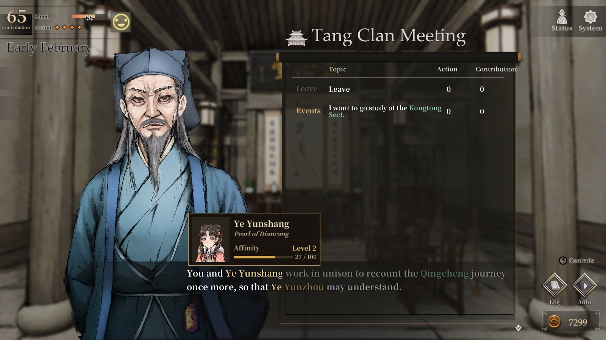
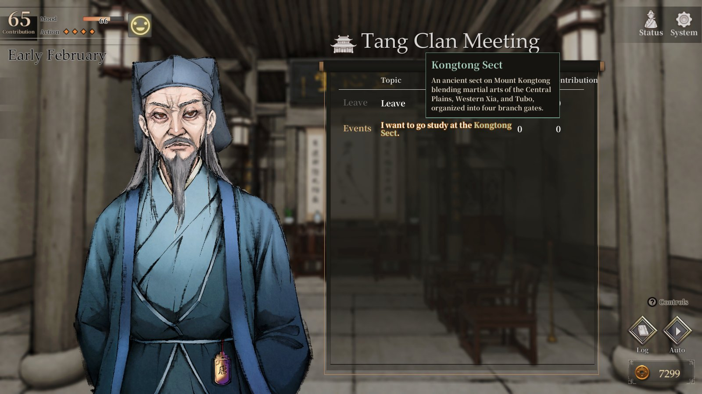
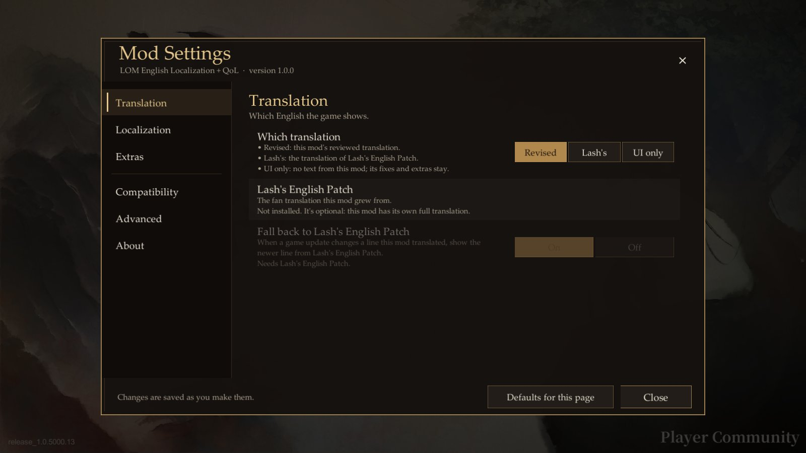

# LOM English Localization + QoL

A complete, reviewed English translation of **Legend of Mortal** (活俠傳, Obb Studio), with layout fixes for English and a
handful of quality-of-life features.

It is built on **[Lash's English Patch](https://github.com/joshfreitas1984/LegendOfMortalOverLlm)**, the original English
patch for the game, and it is made to work alongside it. See [Thanks to Lash](#thanks-to-lash).

**[Download the latest release](https://github.com/DataRogue/LOM-English-Localization-QoL/releases/latest)** ·
[Features](#features) · [Install](#install) · [Thanks to Lash](#thanks-to-lash) · [Updates and forks](#updates-and-forks)
· [Troubleshooting](#troubleshooting) · [Report a problem](https://github.com/DataRogue/LOM-English-Localization-QoL/issues)

## Features

### Translation

- **The whole game in English.** All 72,524 game-data entries (items, skills, stats, menus and story) and all 52,714
  scene lines were reviewed in their scene, for accuracy and for the wuxia voice of the original.
- **One consistent glossary** for names, sects, titles, ranks and martial arts. 唐門 is always the Tang Clan, and 內力
  always Internal Force.
- **Names restored** where the machine translation had turned them into words.
- **Choices you can trust.** Every choice line was checked against the story branch it leads to.
- **Your pick of text.** Choose between this mod's translation, the text of Lash's English Patch, or no text from this
  mod at all ("UI only"). You can switch in the game.

### Screens that fit English

- **Layout fixes** where English would overflow, overlap or be cut off. They cover the status screens, martial arts,
  upgrades, the fate shop, the HUD, menus, dialogue, settings, the library, save slots, duels and army battles.
- **Translated images** for the title, the menus and other art with Chinese baked in.
- **Horizontal layouts** where the game stacks Chinese text vertically.
- **English numerals** instead of Chinese ones.
- **Dialogue tuned for English:** line spacing and text speed, since English runs about twice as long as the Chinese.
- **Long dialogue logs stay readable**, where the game's own backlog would go blank.

### Quality of life (all optional)

- **Quick save and quick load** with F5 and F9, wherever the game allows saving.
- **Character tooltips.** Point at a name in dialogue or a choice menu to see the character's portrait, title and your
  affinity. A character gets a tooltip only once the story has introduced them, so tooltips never spoil a reveal.

  
- **Faction tooltips.** Each sect, clan and gang has a short, spoiler-free description.

  
- **Exact affinity values** in Status > Social.
- **Clearer duel gauges.** Poison and paralysis get a mark at every tier (50, 100 and 150). The gauge's tooltip gives
  the exact build-up, what each tier does and how fast the build-up falls.

  

### Settings and game updates

- **An in-game Mod Settings window.** Open it with F8, or with the button on the title screen and in the pause menus.
  Each setting has one plain sentence of help, and almost all of them apply immediately.
- **Built to survive game updates.** Each feature checks the game when it starts. If an update breaks one, that feature
  switches itself off and says so, and the rest of the mod keeps working.
- **Works with or without Lash's English Patch.** See [below](#made-to-work-with-lashs-english-patch).

## Install

You need Legend of Mortal on Steam for Windows, with the game language on **Traditional Chinese** (the default); the mod
shows that language in English. It is tested with game version `release_1.0.5000.13` (Steam build 20337760).

1. Download `LOM-English-Localization-QoL-<version>-full.zip` from
   [Releases](https://github.com/DataRogue/LOM-English-Localization-QoL/releases/latest).
2. In Steam, right-click Legend of Mortal > **Manage** > **Browse local files**. This opens the folder that holds
   `Mortal.exe`.
3. Extract the zip into that folder, so that `winhttp.dll` and the `BepInEx` folder sit next to `Mortal.exe`.
4. Start the game. The title screen now has a **Mod Settings** button; F8 opens the same window anywhere.

The full package includes [BepInEx](https://github.com/BepInEx/BepInEx) 6.0.0-be.692, the mod loader. If you already
have it, for example because Lash's English Patch is installed, use the smaller `-mod-only.zip` instead.

**Updating:** delete the folder `BepInEx/plugins/LOM_UI_EN`, then extract the new `-mod-only.zip` into the game folder.
Your settings are kept in `BepInEx/config`.

**Uninstalling:** delete `BepInEx/plugins/LOM_UI_EN`. If no other mod uses BepInEx, also delete the `BepInEx` folder,
`winhttp.dll`, `doorstop_config.ini`, `.doorstop_version` and `changelog.txt`. Steam's "Verify integrity of game files"
does not remove mods.

**Steam Deck and Linux (Proton):** not tested. BepInEx under Proton usually needs the launch option
`WINEDLLOVERRIDES="winhttp=n,b" %command%`.

## Thanks to Lash

This mod would not exist without **Lash** and
[Lash's English Patch](https://github.com/joshfreitas1984/LegendOfMortalOverLlm), the original English patch for Legend
of Mortal. It is the translation this mod started from:
- the first versions of this mod were layout fixes on top of it;
- its text was the starting point of every review pass since;
- many lines here still keep Lash's wording, and three of the layout files are Lash's.

Thank you, Lash, for opening this game up to English-speaking players in the first place.

### Made to work with Lash's English Patch

This mod is made to be compatible with Lash's patches, and you can keep both installed:
- It never changes the patch's files; it only reads them.
- Mod Settings > Translation lets you choose the text:
  - this mod's reviewed translation ("Revised");
  - Lash's own translation ("Lash's");
  - "UI only", which leaves all the text to Lash's patch and keeps this mod's layout fixes and extras.
- After a game update, where a line of this mod no longer fits the game, it can show Lash's newer line instead ("Fall
  back to Lash's English Patch").
- The mod-only package installs next to Lash's patch, which already includes BepInEx.

It is tested alongside Lash's English Patch as released in February 2026.

## Updates and forks

A note from the maintainer: I may be slow to update this mod, especially after a game update. Two things soften that.

- **The mod keeps working after a game update.** Anything the update breaks switches itself off, and the rest carries
  on. New or changed game text may show in Chinese until the mod catches up. With Lash's English Patch installed, its
  lines fill in wherever it has them.
- **You don't have to wait for me.** You are welcome to fork this repository, update it yourself and share your version.
  You don't need to ask. The code is MIT-licensed and the translation text is free to reuse with credit (see
  [Licence](#licence)). The developer guide's
  [Updating in a fork](docs/DEVELOPMENT.md#updating-in-a-fork) explains how to fix what a game update broke, bring the
  text up to date, test your build and package it. If you keep an updated fork, feel free to
  open an issue here with a link, so players can find it.

## Troubleshooting

- **Nothing changed, and there is no Mod Settings button.** The files are probably one folder too deep. `winhttp.dll`
  must be next to `Mortal.exe`, not inside a `LOM-English-Localization-QoL...` folder. After a start, `BepInEx/LogOutput.log`
  should exist.
- **Some text is still in Chinese.** Check that the game language is Traditional Chinese. After a game update, new or
  changed text stays Chinese until the mod is updated; Mod Settings > Compatibility says what changed.
- **My antivirus flags `winhttp.dll`.** It is BepInEx's loader, Unity Doorstop, and is unmodified from the official
  BepInEx release. Loaders like it are a common false positive.
- **After a game update, a feature is marked as not working.** It switched itself off to keep the game working. The rest
  of the mod is fine. Please report it, attaching the report described below.

## Reporting a problem

Open an [issue](https://github.com/DataRogue/LOM-English-Localization-QoL/issues) and attach:
- `compat_report.txt`, from Mod Settings > Compatibility > **Write a report** (it is written to
  `BepInEx/plugins/LOM_UI_EN`);
- `BepInEx/LogOutput.log`;
- a screenshot, for anything about text or layout.

For a translation error, the Chinese line and where it appears help most.

## How the translation was made

This mod started from Lash's English Patch, a machine translation of the whole game, and went through a series
of passes:
- a terminology glossary built from the game data, with 23 rulings on the contested terms made by the maintainer;
- a sweep that restored personal names the machine translation had turned into words;
- a review of every choice against the script it branches to;
- a proofread of chapters 1 to 3;
- a line-by-line review of everything else, each line with its scene and the code around it for context.

The reviews were done with LLM assistance: each line was reviewed by a model, each rewrite was checked by a second pass,
random samples were audited, and the maintainer ruled on the glossary. It is not a human professional translation. If
something reads wrong, please report it.

## Building from source

The plugin is C# for BepInEx 6 on Unity 2020.3 Mono. `src/LOM_UI_EN/build.ps1` builds it with the compiler that comes
with Visual Studio 2022 or later. The build is deterministic, so you can check a release DLL against the source. The
translation lives in `workspace/`, and `tools/` holds the maintainer tools that turn it into the plugin folder and
package releases. See [docs/DEVELOPMENT.md](docs/DEVELOPMENT.md).

## Credits

- **Lash**, for [Lash's English Patch](https://github.com/joshfreitas1984/LegendOfMortalOverLlm), the original English
  patch this mod grew from. Lines that kept its wording, and three layout files, are Lash's work.
- **[BepInEx](https://github.com/BepInEx/BepInEx)** (LGPL-2.1), the mod loader, bundled unmodified in the full package.
- **[XUnity.AutoTranslator](https://github.com/bbepis/XUnity.AutoTranslator)** (MIT): its translation-file format and
  lookup are ported in the scene text engine.
- **[Newtonsoft.Json](https://github.com/JamesNK/Newtonsoft.Json)** (MIT), shipped unmodified as Unity's AOT build from
  its `com.unity.nuget.newtonsoft-json` package (Unity Companion License).
- The CSV parser by ideafixxxer, as bundled in [Fungus](https://github.com/snozbot/fungus) (MIT), ported for reading the
  string table exactly as the game does.
- The Korean UI plugin (LegendOfMortal_UI_KR), whose layout approach the first version of this mod built on.

Full notices are in `THIRD_PARTY_NOTICES.txt`, and in `BepInEx/THIRD_PARTY_NOTICES-BepInEx.txt` in the full package.

## Licence

- **Code** (the plugin in `src/` and the tools in `tools/`): [MIT](LICENSE).
- **Translation text** (`workspace/` and the files the release ships in `translation/`, `strings/`, `nametips.tsv` and
  `factiontips.tsv`): you may reuse it in other Legend of Mortal mods and translations, with credit to this project.
  Lines kept from Lash's English Patch remain Lash's work.
- **The game itself:** Legend of Mortal and its text, names and art belong to Obb Studio. The translated images in
  `sprites/` are edited game art. This is an unofficial fan project, not affiliated with or endorsed by Obb Studio.
  Please buy the game.
